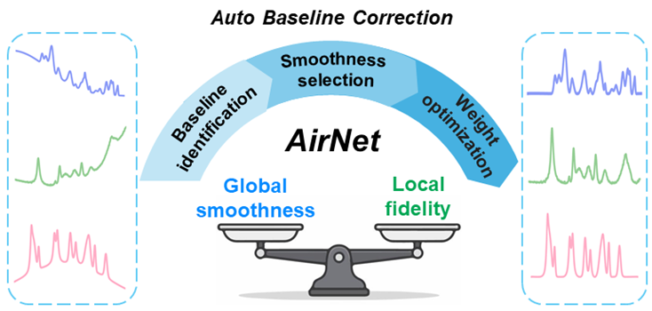

# AirNet: Automated Baseline Correction for Raman Spectra

**@Sanlei-Wang**

## 📖 Introduction
Baseline correction is a critical preprocessing step to eliminate non-Raman scattering backgrounds in Raman/SERS spectra, ensuring accurate peak positions and intensities for both qualitative and quantitative analysis. Recently, various machine-learning-based approaches have been proposed for automatic baseline correction. Nevertheless, their generalizability is often constrained since neither background physicochemical origins nor critical fitting parameters are fully understood. 

To address this, we developed **AirNet**, an automated baseline-correction algorithm that integrates deep learning with chemometrics to balance global smoothness and local fidelity.

## ⚙️ How AirNet Works
Our AirNet framework processes Raman spectra through three essential steps:
1. **Feature Identification:** Raman peaks and baselines are identified with initialized weights using a ResUNet-based model.
2. **Parameter Optimization:** An optimal smoothing parameter is adaptively selected by a multi-indicator evaluation strategy.
3. **Baseline Fitting:** A reliable baseline is achieved with refined weights by a dynamic and robust adaptive iteratively reweighted penalized least squares (Dr-airPLS) algorithm under optimized smoothness.

## ✨ Key Features
- **Superior Performance:** Outperforms widely-used algorithms like airPLS, OP-airPLS, and DIRAS in both accuracy and generalizability on simulated and experimental spectra.
- **Fast Execution:** Achieves a highly efficient processing speed of **0.3s** per spectrum.
- **Homologous Model:** Ensures consistent baseline correction across homologous spectra.
- **Segmented Fitting Strategy:** Applies region-specific smoothing parameters, effectively handling Raman spectra with drastically changing background gradients.
- **High-Fidelity:** Extracts true Raman spectral information, providing a solid basis for reliable spectrum-structure correlations.

## 📚 Article
For more detailed information regarding the methodology and experimental analyses, please refer to our published paper:
- [Read the Article (Analytical Chemistry)](https://pubs.acs.org/doi/10.1021/acs.analchem.6c01550)

## 🗺️ Workflow

## ☁️ Online Processing
You can directly test and process your spectra using our online platform: 
👉 **[Raman Cloud](https://ramancloud.xmu.edu.cn/process_spectra)**

